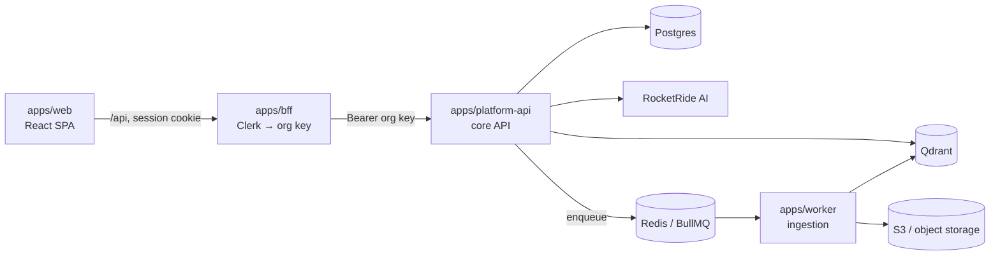

# Meshify

**The operating system for engineering knowledge.** Meshify indexes a team's
repositories and documents into per-project vector stores and answers
engineering questions with **cited, confidence-scored** responses — a calm,
Google-grade web workspace on top of an AI-native backend.

Built on [RocketRide](.rocketride/docs/ROCKETRIDE_README.md) for all
LLM / embedding / RAG orchestration.

> **📖 Full engineering documentation:** the canonical handbook lives at
> **[docs/README.md](docs/README.md)** — architecture, subsystems, AI/RAG,
> testing, and operations.

---

## Features

- **Ask Mesh** — grounded chat over your code + docs, with citations, confidence scores, and jump-to-source.
- **Repositories** — connect a GitHub repo (or upload a ZIP); Meshify clones, scans, and embeds it.
- **Documents** — drop in PDFs / Markdown / Office files; they're indexed automatically.
- **Semantic search** — meaning-based retrieval across code, docs, and past conversations.
- **Project isolation** — every project is a tenant with its own vector collections; cross-tenant access is impossible by construction.

## Architecture at a glance



A **pnpm + Turborepo** monorepo of five apps and ten shared packages. See the
[System Overview](docs/architecture/overview.md) for the full picture.

## Quickstart

### Prerequisites
- **Node 20+** and **pnpm 9** (pinned via `packageManager`)
- **Docker** (Postgres, Redis, Qdrant, MinIO)
- Keys for **Clerk** (auth), **RocketRide** (AI), and a **GitHub App** (repo ingestion)

### 1. Install & configure
```bash
git clone https://github.com/HritikKaushik/Meshify.git
cd Meshify
pnpm install
cp .env.example .env        # fill in CLERK_*, ROCKETRIDE_*, and VITE_CLERK_PUBLISHABLE_KEY
```
Every variable is validated at boot by [`@meshify/config`](packages/config/README.md) —
see the [Environment Variables](docs/reference/environment-variables.md) reference.

### 2. Start infrastructure & apply migrations
```bash
docker compose -f infrastructure/docker/docker-compose.yml up -d \
  postgres redis qdrant minio minio-init rocketride
pnpm migrate                # applies packages/data-access/migrations/*.sql
```

### 3. Run the stack
```bash
pnpm dev                    # web + bff + platform-api + worker via Turbo
```
Then open **http://localhost:5174** and sign in. The web app calls the BFF at
`/api`, which authenticates to the core API — the browser never holds a platform
credential.

Prefer to run pieces individually?
```bash
pnpm dev:web        # React SPA        (http://localhost:5174)
pnpm dev:bff        # backend-for-frontend
pnpm dev:api        # core API         (/health/ready checks pg/redis/qdrant)
pnpm dev:worker     # ingestion worker
```

### Run everything in Docker
```bash
docker compose -f infrastructure/docker/docker-compose.yml up -d --build
docker compose -f infrastructure/docker/docker-compose.yml up -d --scale worker=3
```
For a fully in-cluster stack, set **`QDRANT_URL=http://qdrant:6333`** in `.env`
before `up` — unlike Postgres/Redis/S3 (which compose points at the internal
services automatically), `QDRANT_URL` is read from `.env` so it can also target
Qdrant Cloud. Without it the API's `/health/ready` reports Qdrant `down` (503).
The web SPA is served at http://localhost:5174 and proxies `/api` to the BFF.

### Talking to the API directly
The core API is API-key authenticated. Issue an org key with
[`packages/data-access/src/scripts/issue-api-key.ts`](packages/data-access/src/scripts/issue-api-key.ts)
and send it as `Authorization: Bearer …`. See [Auth](docs/backend/auth.md).

## Monorepo layout

```
apps/
  web/                 React + Vite web workspace (the UI)
  bff/                 backend-for-frontend: Clerk session → org API key, proxy
  platform-api/        core HTTP API (Clean Architecture per module)
  worker/              BullMQ processors — document + repository ingestion
  observability/       persists RocketRide pipeline traces
packages/
  config/              zod-validated env schema — the only place process.env is read
  shared/              structured, credential-safe logger
  data-access/         Postgres entities + repositories + migrations
  vector-store/        Qdrant provisioning + search/delete
  embeddings/          provider-agnostic text embedding
  queues/              BullMQ queue + job-option definitions
  object-storage/      S3-compatible client
  github/              GitHub App client (repo cloning)
  rocketride-gateway/  the only package that imports the RocketRide SDK
  testing/             shared test factories, mocks, matchers (@meshify/testing)
tests/                 repository-wide suites (smoke, contracts, integration, e2e)
docs/                  the engineering handbook
infrastructure/        docker-compose + Kubernetes manifests
```

Each app and package carries its own README — start from the
[handbook's ownership map](docs/README.md#package--application-ownership).

## Common commands

| Command | What it does |
| --- | --- |
| `pnpm dev` | run the whole stack (Turbo) |
| `pnpm build` | build all apps/packages (cached) |
| `pnpm typecheck` | `tsc` across the workspace |
| `pnpm test` | Turbo-orchestrated Vitest suites |
| `pnpm test:coverage` | unified coverage report → `coverage/` |
| `pnpm migrate` | apply pending Postgres migrations |
| `pnpm --filter @meshify/rocketride-gateway check` | verify RocketRide connectivity |

## Testing

Standardized on **Vitest** with a shared [`@meshify/testing`](packages/testing/README.md)
package and a repository-wide suite. See [TESTING.md](TESTING.md) and the
[Testing handbook](docs/testing/index.md).

## Deployment

The production target is **Render**: the root [`render.yaml`](render.yaml) Blueprint
creates the five services (web public; BFF, API, worker, observability private)
plus Render Postgres and Key Value, and points at managed Qdrant Cloud / Backblaze B2
/ RocketRide by env var. Create it once via *Render → New → Blueprint*, then release
by pushing a `vX.Y.Z` tag: [`deploy.yml`](.github/workflows/deploy.yml) rolls the
tagged commit out through the Render API (API first, so its pre-deploy migration
lands before anything else) and smoke-tests the public chain. Every push to `main`
/ `development` runs CI (lint, typecheck, build, tests, `pnpm audit`, gitleaks,
`render.yaml` schema validation, image builds + Trivy).

Step by step: [Deployment Runbook](docs/operations/DEPLOYMENT_RUNBOOK.md).
Alternatives: Railway (`apps/*/railway.toml`) and Kubernetes
([`infrastructure/kubernetes`](infrastructure/kubernetes/README.md)).

## Tech stack

**Web:** React 18, Vite, React Router, Clerk, Tailwind ·
**Backend:** Node, Express, BullMQ, pino ·
**Data:** PostgreSQL, Redis, Qdrant, S3-compatible storage ·
**AI:** RocketRide (LLM/embeddings/RAG) ·
**Tooling:** pnpm, Turborepo, TypeScript, Vitest.

## Documentation

Start with the **[Engineering Handbook](docs/README.md)** →
[System Overview](docs/architecture/overview.md) ·
[Getting Started](docs/development/getting-started.md) ·
[RAG & Ingestion](docs/ai/rag-and-ingestion.md) ·
[Contributing](docs/contributing/index.md).
