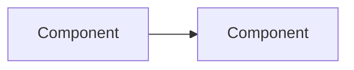

# <Title>

> One-paragraph summary. What is this, and why should the reader care?

## Overview
<The what and the why. Keep to a few short paragraphs.>

## Architecture
<How the pieces fit. Include a Mermaid diagram where it clarifies.>

## Implementation
<How it actually works in this repo. Reference real files, e.g.
`apps/platform-api/src/modules/<x>/...`. Keep sections small and titled.>

## Best Practices
<What to do. Bullet list.>

## Common Mistakes
<What to avoid, and why. Bullet list.>

## Troubleshooting
<Symptom → cause → fix table where possible.>

## Examples
<Concrete, runnable or copy-pasteable examples.>

## References
<Links to the actual source files, configs, and external docs this describes.>

## Related
<Links to sibling documents.>

## Next
<What to read after this. 1–3 links.>

---
[← Handbook](README.md)
