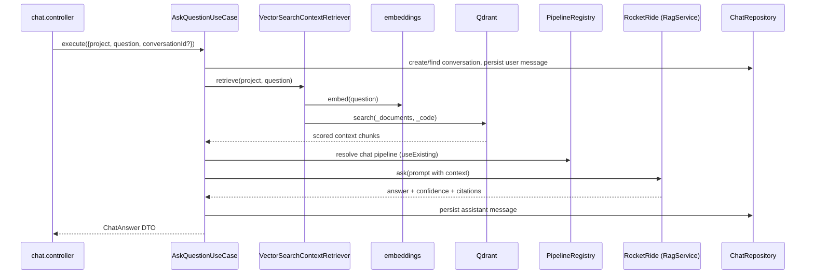
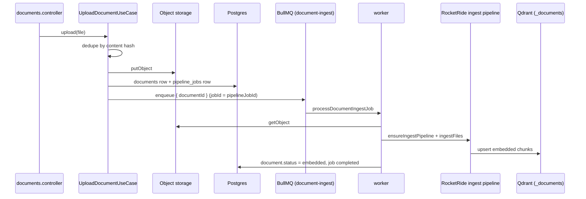
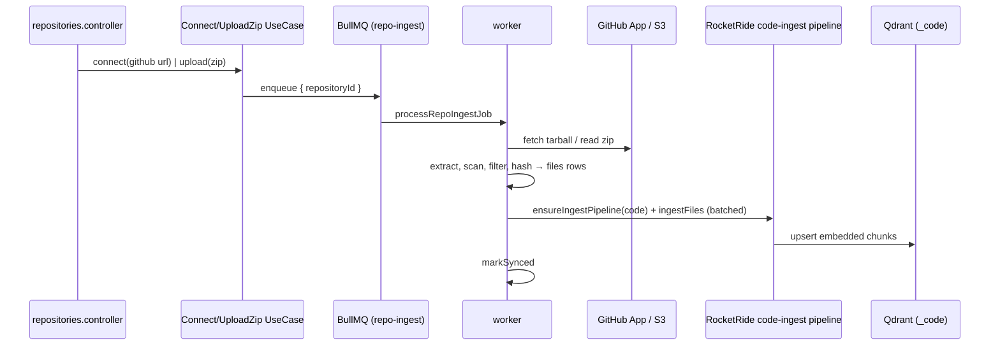

# RAG & Ingestion

> Meshify's intelligence is three flows: **chat** (retrieve → prompt → generate),
> **document ingestion**, and **repository ingestion**. All AI work goes through
> one gateway, [`@meshify/rocketride-gateway`](../../packages/rocketride-gateway/README.md);
> retrieval goes straight to Qdrant.

## Overview

- **Chat** is synchronous (request/response). Retrieval happens outside RocketRide (direct Qdrant query), then the prompt is generated by a RocketRide chat pipeline.
- **Ingestion** is asynchronous (BullMQ). A worker streams files through a project's RocketRide *ingest* pipeline into Qdrant.
- **Isolation:** each project has its own `_documents` and `_code` Qdrant collections (see [Data Model](../architecture/data-model.md#postgres--qdrant)).

## Architecture

### Chat (retrieval-augmented generation)

Key files: `apps/platform-api/src/modules/chat/application/ask-question.usecase.ts`,
`.../infrastructure/vector-search-context-retriever.ts`,
`.../domain/build-rag-prompt.ts`,
`.../infrastructure/rocketride-chat-pipeline.resolver.ts`.

**Resilience:** a stale pipeline token is self-healed once — the resolver
invalidates and retries a single time before surfacing a `502`.

### Document ingestion

Key files: `apps/platform-api/src/modules/documents/application/upload-document.usecase.ts`,
`apps/worker/src/processors/document-ingest.processor.ts`.

### Repository ingestion

Key files: `apps/worker/src/processors/repo-ingest.processor.ts`,
`apps/worker/src/repo/{archive-extractor,repo-scanner}.ts`.

### Slack ingestion (Connector Framework)

Slack is the first source built on the generic [Connector Framework](../backend/connectors.md).
Channel history is grouped into **conversation documents** (a thread, or a
time-windowed run of messages — never per-message embeddings) and streamed
through the project's existing **docs-ingest** pipeline into the `_documents`
collection under a `slack/<team>/<channel>/<key>` source path. All Slack metadata
(channel, thread, author, timestamps, permalink, reactions, participants,
visibility) is preserved in `slack_conversations`. Incremental sync uses a
per-channel `last_synced_ts` cursor and skips unchanged conversations by content
hash. Key files: `apps/worker/src/slack/{conversation-grouper,ingest-workspace}.ts`,
`apps/worker/src/processors/slack-{ingest,sync}.processor.ts`.

### Citations across sources

Chat citations derive `sourcePath` from Qdrant, then are enriched per source: a
`slack/…` path is resolved back to its `slack_conversations` row
(`SlackCitationEnricher`) so the citation carries the Slack channel, thread,
author, timestamp, and permalink. Search results carry a `source` facet
(github/documents/slack) and support a `slack` scope.

## Implementation

### The gateway boundary
Only `@meshify/rocketride-gateway` imports the `rocketride` SDK. It exposes
`RagService` (chat + ingest), `PipelineRegistry` (reuse pipelines via
`useExisting`), and a client pool. Retrieval does **not** use RocketRide — it
queries Qdrant directly because RocketRide's Qdrant component can't apply the
metadata filters search needs.

### Embeddings
`@meshify/embeddings` selects a provider from the project's embedding profile
(`createEmbeddingProvider`). It is a thin, stateless `fetch` wrapper.

### Teardown
Deleting a document/repository purges its Qdrant chunks (by `source_path`) and
its object-storage blob, best-effort, before removing the DB row — see the
`Delete*UseCase` classes.

## Best Practices
- Add AI capability behind `rocketride-gateway`; keep platform-api/worker SDK-free.
- Reuse pipelines through `PipelineRegistry`; never create a pipeline per request/job.
- Keep chunk sizes within RocketRide guidance (`.rocketride/docs`).

## Common Mistakes
- Querying Qdrant with an ad-hoc client instead of `@meshify/vector-store`.
- Blocking the request path on ingestion — ingestion is always a queued job.
- Forgetting to purge vectors on delete (leaves orphaned chunks answering queries).

## Troubleshooting
| Symptom | Cause | Fix |
| --- | --- | --- |
| Chat 502 | RocketRide unreachable / pipeline invalid | Check `ROCKETRIDE_URI`; the resolver retries once |
| Doc stuck "processing" | Worker down or job dead-lettered | See [Queues & Workers](../backend/queues-and-workers.md) |
| Empty answers | Nothing indexed yet / wrong collection | Confirm ingestion completed for the project |

## Examples
See the chat use case test `apps/platform-api/src/modules/chat/application/ask-question.usecase.test.ts`
for the retrieve → ask → persist contract, including the self-heal retry.

## References
- `apps/platform-api/src/modules/chat/**`, `apps/worker/src/processors/**`
- `packages/rocketride-gateway/src/**`, `packages/vector-store/src/**`, `packages/embeddings/src/**`
- `.rocketride/docs/` (RocketRide pipeline rules)

## Related
- [Queues & Workers](../backend/queues-and-workers.md) · [Data Model](../architecture/data-model.md)

## Next
- [Queues & Workers](../backend/queues-and-workers.md) — the async machinery behind ingestion.

---
[← Handbook](../README.md)
