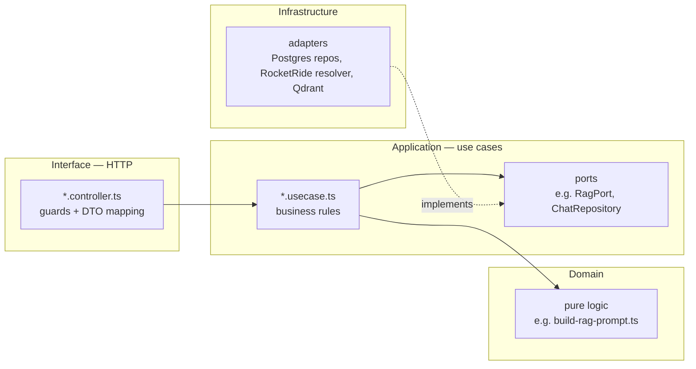
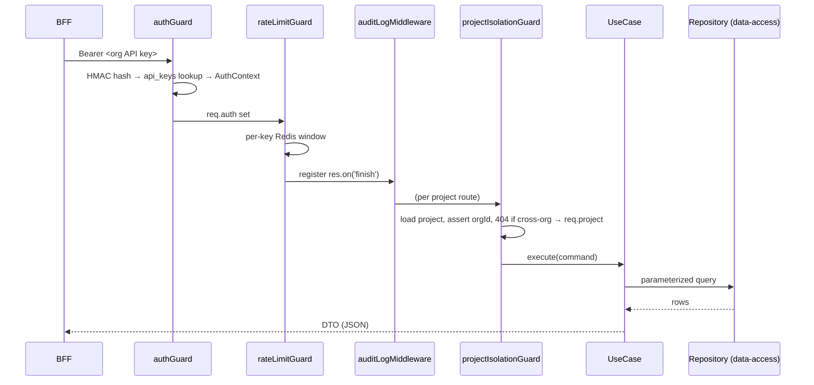

# Backend Architecture

> `apps/platform-api` is the core service. It follows Clean Architecture:
> dependencies point inward (Domain ← Application ← Infrastructure ← Interface),
> and the wiring happens in a single composition root, `src/main.ts`.

## Overview

Each feature is a **module** under `apps/platform-api/src/modules/<domain>/`,
split into four layers. HTTP controllers are thin; business rules live in
**use cases**; data access lives behind **repository ports** implemented in
[`@meshify/data-access`](../../packages/data-access/README.md).

Modules present today: `health`, `security`, `projects`, `documents`,
`repositories`, `connectors`, `slack`, `chat`, `retrieval`, `jobs`. (`retrieval`
is shared infrastructure for `chat` — the embedding-provider factory + result
ranking; the standalone search + evaluation endpoints were removed.)

## Architecture

### Layers



Dependency rule: **inner layers never import outer layers.** Controllers depend
on use cases; use cases depend on ports (interfaces); infrastructure implements
those ports and is injected in `main.ts`.

### Module anatomy (example: `chat`)

```
apps/platform-api/src/modules/chat/
  domain/          build-rag-prompt.ts, referenced-code-files.ts   (pure)
  application/     ask-question.usecase.ts, list/update/delete/get-conversation-messages.usecase.ts
                   chat-pipeline.port.ts, chat-context-retriever.port.ts   (ports)
  infrastructure/  rocketride-chat-pipeline.resolver.ts, vector-search-context-retriever.ts
  interface/       chat.controller.ts   (routes, zod validation, DTO mapping)
```

### Request lifecycle



Guard order is set in `apps/platform-api/src/main.ts`:
`authGuard → rateLimitGuard → auditLogMiddleware`, then each project route adds
`projectIsolationGuard(getProject)`.

## Implementation

### The rules
- **No repository in a controller.** Controllers receive use cases; use cases receive repository ports. (Enforced by convention; the `chat` module was refactored to this in the git history.)
- **No raw SQL outside `data-access`.** All queries are parameterized in `packages/data-access/src/**/postgres-*.repository.ts`.
- **No RocketRide SDK outside `rocketride-gateway`.** platform-api talks to `@meshify/rocketride-gateway` (`RagService`, `PipelineRegistry`), never the `rocketride` package.

### Composition root
`apps/platform-api/src/main.ts` constructs every repository, gateway, and use
case once and injects them into controllers. This is the only place concrete
infrastructure is chosen — making every use case unit-testable with the
in-memory ports from [`@meshify/testing`](../../packages/testing/README.md).

### Validation & errors
- Request bodies are validated with **zod** in controllers (e.g. `askSchema`, `updateChatSchema`).
- Domain errors are typed (e.g. `ChatNotFoundError`, `RepositoryNotFoundError`, `DocumentNotFoundError`) and mapped to HTTP status in the controller.

## Best Practices
- Put a new rule in a **use case**, not a controller or repository.
- Add a repository **method to the port** first, implement it in Postgres, then use it — keep the interface the contract.
- Return domain entities from use cases; map to DTOs in the controller (`toResponse`, `toConversationSummary`, …).

## Common Mistakes
- Reaching for `pool.query` in a use case — inject a repository instead.
- Throwing raw `Error` for a not-found — use a typed error so the controller can map status.
- Doing project-scoping in the controller — that's the `projectIsolationGuard`'s job; use `req.project.id`.

## Troubleshooting
| Symptom | Cause | Fix |
| --- | --- | --- |
| Route returns 404 for a valid id | Cross-org access blocked by isolation | Confirm the API key's org owns the project |
| 401 on every request | `authGuard` rejects the key | Check `PLATFORM_API_KEY_PEPPER` and the key hash |
| 429s | `rateLimitGuard` window exceeded | Tune `RATE_LIMIT_MAX` / `RATE_LIMIT_WINDOW_SEC` |

## Examples
Adding an endpoint (sketch):
1. Add/extend a repository port + Postgres impl in `data-access`.
2. Write a `*.usecase.ts` in the module's `application/`.
3. Add a route in the module's `*.controller.ts` (zod + DTO mapping).
4. Wire the use case in `main.ts`.
5. Unit-test the use case with `@meshify/testing` mocks. See [Contributing](../contributing/index.md).

## References
- `apps/platform-api/src/main.ts` (composition root)
- `apps/platform-api/src/modules/**` (modules)
- `apps/platform-api/src/modules/security/interface/*.guard.ts`, `.../audit-log.middleware.ts`

## Related
- [Auth](../backend/auth.md) · [Queues & Workers](../backend/queues-and-workers.md) · [Data Model](data-model.md)

## Next
- [RAG & Ingestion](../ai/rag-and-ingestion.md) — the chat and ingestion use cases in depth.

---
[← Handbook](../README.md)
