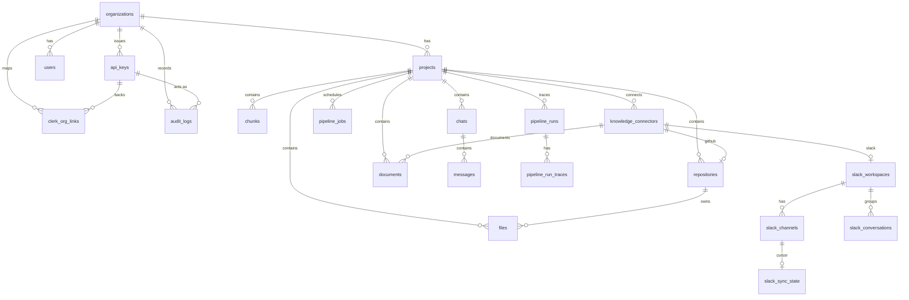
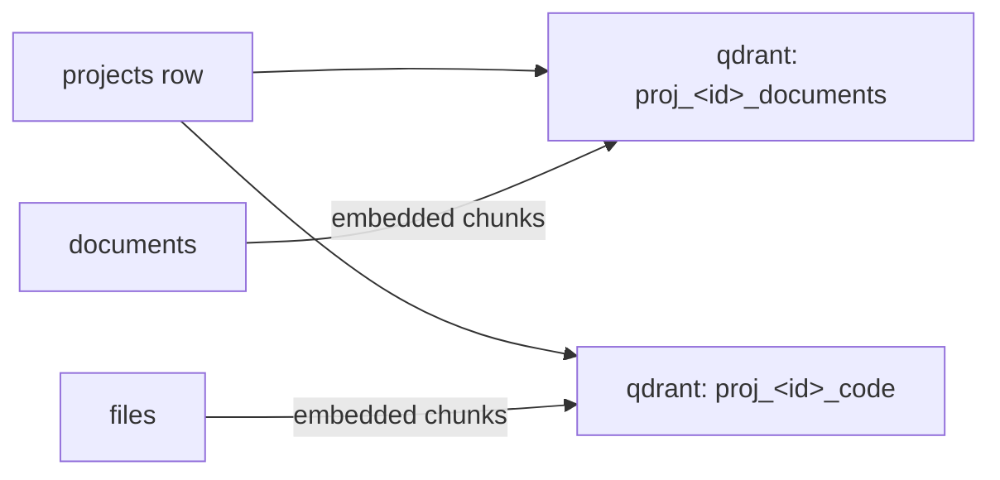

# Data Model

> Postgres holds the system of record; Qdrant holds the vectors. Schema is
> defined by forward-only SQL migrations in
> [`packages/data-access/migrations`](../../packages/data-access/migrations) and
> accessed only through repositories in `packages/data-access/src`.

## Overview

- **Migrations:** `0001_init.sql` … `0010_job_progress.sql`, applied by `packages/data-access/src/migrate.ts` (`pnpm migrate`).
- **Access:** one repository per aggregate (`postgres-*.repository.ts`), all queries parameterized.
- **Isolation:** almost every table has `project_id` (or `org_id`) with `ON DELETE CASCADE`, so deleting a project/org tears down its data.

## Architecture

### Entity relationships

### Postgres ↔ Qdrant

Each project provisions **two Qdrant collections** at creation
(`packages/vector-store/src/qdrant-collection.provisioner.ts`):

Collection names are stored on the project (`qdrant_collection_docs`,
`qdrant_collection_code`) and derived by `qdrantCollectionName()` in
`packages/data-access/src/projects/project.entity.ts`.

## Implementation

### Key tables
| Table | Purpose | Repository |
| --- | --- | --- |
| `projects` | Tenant workspace + its Qdrant/RocketRide pipeline ids | `postgres-project.repository.ts` |
| `documents` | Uploaded docs + ingestion status | `postgres-document.repository.ts` |
| `repositories` / `files` | Connected repos and their scanned files | `postgres-repository.repository.ts`, `postgres-file.repository.ts` |
| `chats` / `messages` | Conversations and turns | `postgres-chat.repository.ts` |
| `pipeline_jobs` | Durable record of every queued/failed BullMQ job (DLQ mirror) + live `progress`/`stage` for real-time tracking | `postgres-pipeline-job.repository.ts` |
| `knowledge_connectors` | Generic connector aggregate (github/documents/slack) every source is modeled as | `postgres-knowledge-connector.repository.ts` |
| `slack_workspaces` / `slack_channels` | Connected Slack workspace (encrypted token) + its channels | `postgres-slack-workspace.repository.ts`, `postgres-slack-channel.repository.ts` |
| `slack_conversations` / `slack_sync_state` | Grouped conversation documents (+ citation metadata) and per-channel sync cursor | `postgres-slack-conversation.repository.ts`, `postgres-slack-sync-state.repository.ts` |
| `api_keys` / `clerk_org_links` | Auth: hashed org keys + Clerk-org mapping | `postgres-api-key.repository.ts`, `postgres-clerk-org-link.repository.ts` |
| `audit_logs` | Every mutating request | `postgres-audit-log.repository.ts` |
| `pipeline_runs` / `pipeline_run_traces` | RocketRide observability | `postgres-pipeline-run.repository.ts` |

### Indexing (already tuned)
Hot paths are indexed: `messages(chat_id)`, `api_keys.key_hash` (UNIQUE → single
probe on every auth), `clerk_org_links(clerk_org_id)`, every `*_project_id`,
and a partial `pipeline_jobs(status) where status in ('queued','running')`.

## Best Practices
- Change schema with a **new** numbered migration; never edit an applied one.
- Add a `project_id` + `ON DELETE CASCADE` to any new project-scoped table.
- Prefer aggregate queries (`count(*) filter (…)`, `max(...)`) over loading rows to count — see `statsByProject`.

## Common Mistakes
- Editing an already-applied migration (breaks environments that ran it).
- Forgetting an index on a new foreign key used in a filter.
- Reading rows just to `.length` them instead of `count(*)`.

## Troubleshooting
| Symptom | Cause | Fix |
| --- | --- | --- |
| Migration skipped | Already recorded as applied | Add a new migration file |
| Orphaned rows after delete | Missing `ON DELETE CASCADE` | Add the FK constraint |

## Examples
Run migrations locally: `pnpm migrate` (see `packages/data-access/src/migrate.ts`).

## References
- `packages/data-access/migrations/*.sql`
- `packages/data-access/src/**/*.entity.ts`, `**/*.repository.ts`, `migrate.ts`

## Related
- [Backend](backend.md) · [Queues & Workers](../backend/queues-and-workers.md) · [`data-access` README](../../packages/data-access/README.md)

## Next
- [RAG & Ingestion](../ai/rag-and-ingestion.md).

---
[← Handbook](../README.md)
