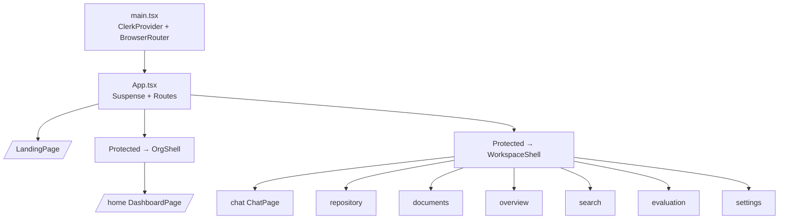
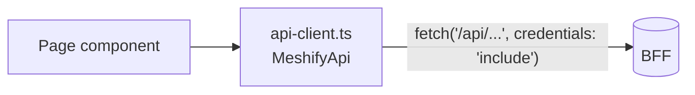

# Frontend Architecture

> `apps/web` is a Vite + React 18 SPA. It authenticates with Clerk, talks only
> to the BFF over same-origin `/api`, and is split into lazily-loaded routes so
> the public landing page stays lean.

## Overview

- **Stack:** Vite, React 18, React Router, Clerk (`@clerk/clerk-react`), Tailwind, `sonner` toasts, `motion` (chat typewriter only).
- **Entry:** `apps/web/src/main.tsx` mounts `ClerkProvider → BrowserRouter → App`.
- **Routing:** `apps/web/src/App.tsx` — public landing eager, authenticated shells + pages lazy.

## Architecture

### Routing & shells

- `Protected` gates routes behind a Clerk session (`SignedIn`/`RedirectToSignIn`).
- `OrgShell` = org-level chrome (Project Home); `WorkspaceShell` = per-project chrome (sidebar + tabs).

### Data access

All network calls go through `apps/web/src/api.ts` (`MeshifyApi`) via the shared
instance in `apps/web/src/api-client.ts`. The browser sends the Clerk session
cookie (`credentials: 'include'`); it never holds a platform API key.

## Implementation

### Code-splitting
`App.tsx` uses `React.lazy` for every authenticated page and both shells, wrapped
in a single `<Suspense>`. The public landing (`LandingPage`) and `NotFoundPage`
are eager for instant first paint. Vendor chunks (`vendor-react`, `vendor-clerk`)
are split in `apps/web/vite.config.ts` for long-term caching. Heavy deps
(`motion` for the chat reveal) load only with their route.

### Design system
- Tokens live in `apps/web/tailwind.config.ts` (the `mc.*` palette) and `apps/web/src/index.css`.
- Shared primitives in `apps/web/src/components/mc/` and `components/common/`.

### State
- Server state is fetched per-page via `useAsync` (`apps/web/src/ui.tsx`); there is no global store beyond small `usePersistent` UI preferences (`apps/web/src/store.ts`).

## Best Practices
- Add a new route as a `React.lazy` import in `App.tsx`; keep landing eager.
- Add API methods to `MeshifyApi` (`api.ts`), not inline `fetch` in components.
- Use the `mc.*` tokens and shared primitives; avoid one-off colors.

## Common Mistakes
- Importing an authenticated page eagerly into `App.tsx` — bloats the landing chunk.
- Calling `fetch` directly in a component — centralize in `api.ts`.
- Storing server data in a global store — prefer per-page fetches.

## Troubleshooting
| Symptom | Cause | Fix |
| --- | --- | --- |
| Redirect loop to sign-in | Missing `VITE_CLERK_PUBLISHABLE_KEY` | Set it in the root `.env` |
| `/api` 404 in dev | BFF not running / proxy target wrong | Check `vite.config.ts` proxy + `BFF_ORIGIN` |
| Big landing bundle | A page imported eagerly | Convert to `React.lazy` |

## Examples
See `apps/web/src/pages/projects/ChatPage.tsx` for the canonical page: fetch via
`api`, render with shared primitives, drive from the `?c=` route param.

## References
- `apps/web/src/App.tsx`, `main.tsx`, `api.ts`, `api-client.ts`, `vite.config.ts`, `tailwind.config.ts`

## Related
- [Auth](../backend/auth.md) · [`apps/web/README.md`](../../apps/web/README.md)

## Next
- [Getting Started](../development/getting-started.md).

---
[← Handbook](../README.md)
