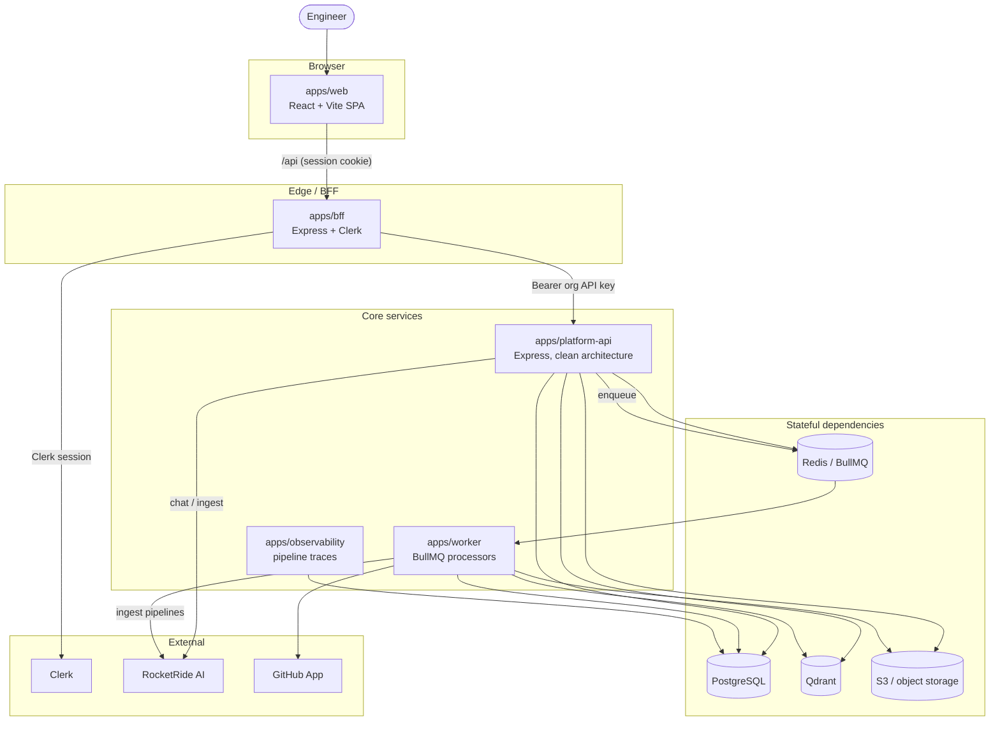
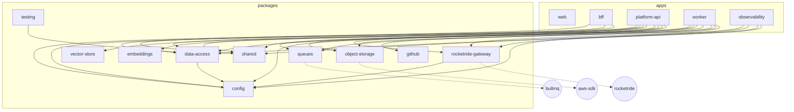

# System Overview

> Meshify indexes a team's repositories and documents into per-project vector
> stores and answers engineering questions with cited, confidence-scored
> responses. This document is the 10,000-ft map; every box links to a deeper doc.

## Overview

Meshify is a **pnpm workspace + Turborepo** monorepo. It is split into
**applications** (deployable processes) and **packages** (shared libraries).
The design goal is strict separation of concerns: the browser never holds
platform credentials, all AI work goes through one gateway, and each project is
isolated down to its own vector collections.

- **Source of truth for structure:** [`pnpm-workspace.yaml`](../../pnpm-workspace.yaml), [`turbo.json`](../../turbo.json)
- **Applications:** `apps/*` — `web`, `bff`, `platform-api`, `worker`, `observability`
- **Packages:** `packages/*` — `config`, `shared`, `data-access`, `vector-store`, `embeddings`, `queues`, `object-storage`, `github`, `rocketride-gateway`, `testing`

## Architecture

### System context

### Request flow (chat, happy path)

1. The browser calls `GET/POST /api/...` on the **BFF** with the Clerk session cookie.
2. The BFF resolves the Clerk session to the org's **platform API key** and proxies to **platform-api** with `Authorization: Bearer …`.
3. platform-api authenticates the key, rate-limits, audits, and resolves the project (isolation).
4. For chat, it retrieves context from **Qdrant** and asks **RocketRide**; for ingestion it writes a row and **enqueues** a BullMQ job.
5. The **worker** consumes ingest jobs and streams files through RocketRide pipelines into Qdrant.

See [Authentication & Authorization](../backend/auth.md) and [RAG & Ingestion](../ai/rag-and-ingestion.md).

## Implementation

### Applications

| App | Role | Entry | Deep dive |
| --- | --- | --- | --- |
| `apps/web` | React SPA (Vite, Clerk, TanStack Router-free React Router) | `apps/web/src/main.tsx` | [Frontend](frontend.md), [README](../../apps/web/README.md) |
| `apps/bff` | Browser-facing gateway: Clerk session → org API key, 1:1 proxy | `apps/bff/src/main.ts` | [Auth](../backend/auth.md), [README](../../apps/bff/README.md) |
| `apps/platform-api` | Core API: projects, documents, repositories, chat, search, evaluation | `apps/platform-api/src/main.ts` | [Backend](backend.md), [README](../../apps/platform-api/README.md) |
| `apps/worker` | BullMQ processors for document + repo ingestion | `apps/worker/src/main.ts` | [Queues & Workers](../backend/queues-and-workers.md), [README](../../apps/worker/README.md) |
| `apps/observability` | Consumes RocketRide pipeline traces into Postgres | `apps/observability/src/main.ts` | [README](../../apps/observability/README.md) |

### Package dependency graph

The rule enforced by this graph: **the RocketRide SDK is only imported inside
`rocketride-gateway`, and raw SQL only exists inside `data-access`** — verified
in [Backend Architecture](backend.md#the-rules).

## Best Practices

- Add cross-cutting logic to a **package**, not an app, when more than one app needs it.
- Keep apps thin: an app wires packages together (composition root in `main.ts`) and owns HTTP/queue interfaces.
- New env vars go through [`packages/config`](../../packages/config/src/env.ts) — see [Environment Variables](../reference/environment-variables.md).

## Common Mistakes

- **Importing the RocketRide SDK outside the gateway** — breaks the AI abstraction; put it behind `rocketride-gateway`.
- **Querying Postgres outside a repository** — data access must live in `data-access`.
- **Calling platform-api directly from the browser** — always go through the BFF so credentials stay server-side.

## Troubleshooting

| Symptom | Likely cause | Where to look |
| --- | --- | --- |
| Browser 401s on `/api` | No Clerk session / org not provisioned | [Auth](../backend/auth.md) |
| Chat returns 502 | RocketRide unreachable | [RAG & Ingestion](../ai/rag-and-ingestion.md) |
| Upload never indexes | Worker down or job dead-lettered | [Queues & Workers](../backend/queues-and-workers.md) |

## References

- [`pnpm-workspace.yaml`](../../pnpm-workspace.yaml), [`turbo.json`](../../turbo.json)
- App entry points: `apps/*/src/main.ts(x)`
- Root [`README.md`](../../README.md)

## Related
- [Backend Architecture](backend.md) · [Frontend Architecture](frontend.md) · [Data Model](data-model.md)

## Next
- [Getting Started](../development/getting-started.md) to run it locally.

---
[← Handbook](../README.md)
