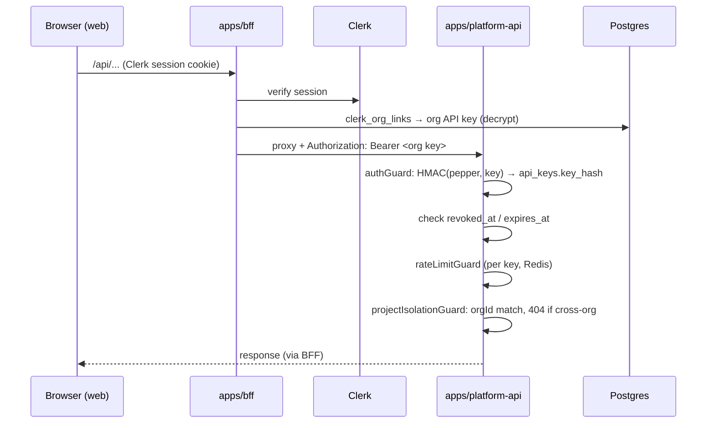
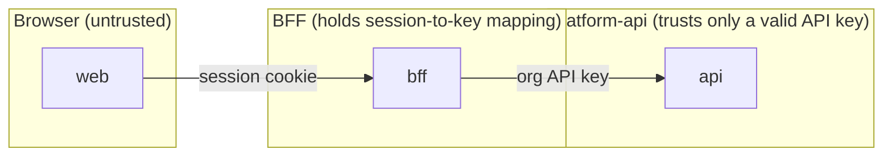

# Authentication & Authorization

> Two boundaries: the **BFF** turns a Clerk session into an org API key; the
> **platform-api** authenticates that key and isolates every request to the
> caller's org and project. The browser never holds a platform credential.

## Overview

- **AuthN (who):** Clerk session (browser ↔ BFF) → HMAC-hashed org API key (BFF ↔ platform-api).
- **AuthZ (what):** `projectIsolationGuard` scopes every project route to the key's `orgId`; cross-org access is `404`, not `403`.
- **Defense in depth:** per-key rate limiting, audit logging of mutations, and credential redaction in logs.

## Architecture

### End-to-end flow

### Trust boundaries

## Implementation

### Keys are never stored in clear
`key_hash = HMAC-SHA256(PLATFORM_API_KEY_PEPPER, plaintext)`. A DB leak alone
cannot verify or reconstruct a key without the pepper. Lookup is a single
indexed probe (`api_keys.key_hash` is `UNIQUE`).
See `packages/data-access/src/api-keys/api-key.entity.ts`,
`apps/platform-api/src/modules/security/application/authenticate.usecase.ts`.

### Uniform failures (no enumeration)
`AuthenticateApiKeyUseCase` returns the **same** error for missing, malformed,
unknown, revoked, and expired keys, so a caller can't probe which keys exist.

### Org secrets are encrypted at rest
The BFF's org API key is stored encrypted (`ORG_KEY_ENCRYPTION_KEY`) and
decrypted only when proxying — see `packages/data-access/src/provisioning/secret-encryption.ts`.

### Isolation
`projectIsolationGuard(getProject)` loads the project, asserts
`project.orgId === req.auth.orgId`, and returns `404` on mismatch. Every project
route uses `req.project.id` — never a body/query `projectId`.
See `apps/platform-api/src/modules/projects/interface/project-isolation.guard.ts`.

### Logging safety
Credentials never reach logs: the shared logger redacts
`req.headers.authorization`, `req.headers.cookie`, and `res.headers["set-cookie"]`
(`packages/shared/src/logger.ts`).

## Best Practices
- Read the tenant from `req.auth.orgId` / `req.project`, never the request body.
- Add mutating routes **after** `auditLogMiddleware` so they're recorded.
- Rotate the pepper/encryption keys via env, never in code.

## Common Mistakes
- Returning `403` for cross-org access (leaks existence) — return `404` via the isolation guard.
- Logging raw headers in a custom middleware (bypasses redaction).
- Trusting a `projectId` from the client instead of the resolved `req.project`.

## Troubleshooting
| Symptom | Cause | Fix |
| --- | --- | --- |
| 401 for everyone | Wrong/absent `PLATFORM_API_KEY_PEPPER` | Align pepper across issuer + API |
| 401 for one org | Key revoked/expired, or missing `clerk_org_links` row | Re-provision the org |
| 404 for a real project | Cross-org access | Use the owning org's key |

## Examples
Issue a key: `packages/data-access/src/scripts/issue-api-key.ts`.
Guard tests: `apps/platform-api/src/modules/security/**/*.test.ts`.

## References
- `apps/platform-api/src/modules/security/**`
- `apps/bff/src/modules/auth/**`, `apps/bff/src/modules/proxy/platform-proxy.ts`
- `packages/data-access/src/{api-keys,provisioning}/**`

## Related
- [Backend](../architecture/backend.md) · [Environment Variables](../reference/environment-variables.md)

## Next
- [Queues & Workers](queues-and-workers.md).

---
[← Handbook](../README.md)
