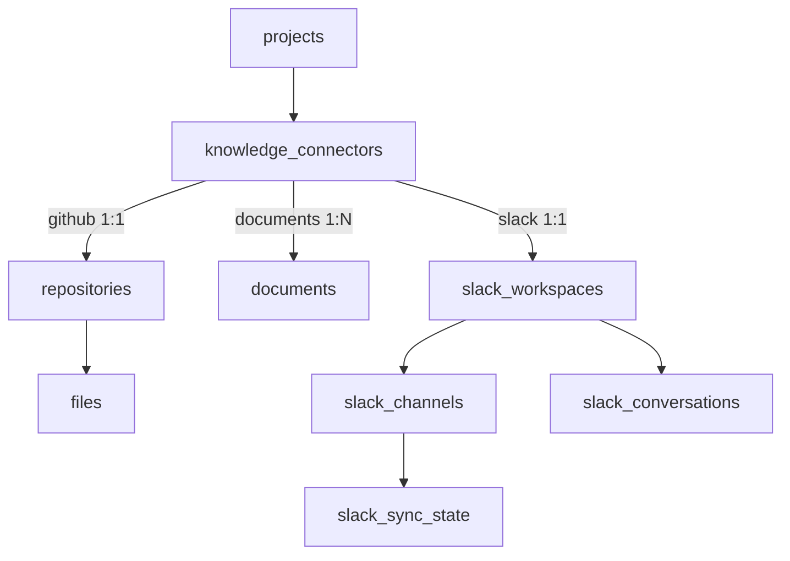

# Connector Framework

> Every knowledge source a project connects — GitHub repositories, uploaded
> Documents, and Slack workspaces (with Confluence, Jira, Notion, Teams, and
> Google Drive to follow) — is modeled as a single **KnowledgeConnector**
> aggregate. Slack is the first source built on this generalized model.

## Overview

Adding each new source as a bespoke ingestion path would multiply duplication.
Instead, `knowledge_connectors` is the parent aggregate; the typed detail tables
(`repositories`, `documents`, `slack_*`) hang off a connector via `connector_id`.
The unified `GET /connectors` endpoint returns every source as one homogeneous
list, and `DELETE /connectors/:id` tears any of them down.

- **Grain:** one `github` connector per repository, one **singleton** `documents`
  connector per project (owns all uploaded files, created lazily on first
  upload), one `slack` connector per workspace (owns its channels + conversations).
- **Additive migration:** [`0009_slack_connectors.sql`](../../packages/data-access/migrations/0009_slack_connectors.sql)
  backfills a connector row for every existing repository/document, so the
  proven GitHub/Documents code paths keep working — they just now write through
  a connector.

## Architecture

Reusable seams every source shares:

- **Read/delete surface** — `KnowledgeConnectorRepository` +
  `ListConnectorsUseCase` (read-time union with per-type stats) +
  `DeleteConnectorUseCase` (dispatches on `type`, reusing the existing
  `deleteBySourcePaths`/`deleteByFilter` vector helpers).
- **Worker lifecycle** — `apps/worker/src/processors/run-pipeline-job.ts`
  (markRunning → work → markCompleted/dead-letter) and `resolve-ingest-token.ts`
  (RocketRide ingest-token resolution), extracted from the document/repo
  processors; the Slack processors are their first clean consumer.
- **UI** — `ConnectorStatusBadge` generalizes `RepoStatusBadge`; the unified list
  comes from `MeshifyApi.listConnectors`.

## Implementation

### Slack specifics

Slack is ingested as **conversation documents**, not per-message embeddings:

1. **OAuth** (`apps/platform-api/src/modules/slack`): `POST …/connectors/slack/oauth/start`
   returns the Slack authorize URL with a signed `state` (carrying the
   projectId, since the redirect URI is static). Slack redirects the browser to
   the same-origin, Clerk-gated web route `/oauth/slack/callback`, which POSTs
   `{code,state}` to `…/oauth/complete`; the token exchange runs server-side and
   the bot token is stored encrypted (`ORG_KEY_ENCRYPTION_KEY`).
2. **Channel selection** persists `selected` and enqueues a `slack-ingest` job.
3. **Ingestion** (`apps/worker/src/slack`): pull channel history + thread
   replies, group into conversation documents (`conversation-grouper.ts` — a
   thread, or a time-windowed run of messages, becomes one document; system
   events like joins/topic-changes are dropped by subtype, and reaction
   summaries are rendered into the embedded text), then stream through the
   project's existing **docs-ingest** pipeline into the `_documents` Qdrant
   collection under a `slack/<team>/<channel>/<key>` source path. All metadata
   (channel, thread, author, timestamps, permalink, reactions, participants,
   visibility) is preserved in `slack_conversations`.
4. **Incremental sync** (`slack-sync` queue): each channel's
   `slack_sync_state.last_synced_ts` is the `oldest` cursor; unchanged
   conversations (by `content_hash`) are skipped, and changed ones have their
   stale vectors purged (`deleteBySourcePaths`) before re-ingesting. Because
   `conversations.history` never resurfaces an old thread parent, each sync also
   re-fetches replies for already-stored threads so an active thread never
   freezes after its first ingest.
5. **Retrieval unchanged:** Search/Chat query Qdrant directly. A `source` facet
   and a `slack` search scope distinguish Slack from GitHub/Documents by source
   path; chat citations for `slack/…` paths are enriched
   (`SlackCitationEnricher`) with channel/thread/author/timestamp/permalink from
   Postgres.

## Best Practices
- Model a new source as a `KnowledgeConnector` type; keep its detail in a typed
  table linked by `connector_id` with `ON DELETE CASCADE`.
- Reuse `runPipelineJob` + `resolveIngestToken` in the new processor rather than
  re-implementing the job lifecycle.
- Keep any new SDK behind its own gateway package (as `@meshify/slack` /
  `@meshify/github`), never imported by platform-api/worker directly beyond the
  gateway.

## Common Mistakes
- Embedding each Slack message individually — group into conversation documents.
- Putting the OAuth callback on a platform-api route Slack redirects to directly
  — it must be the static, same-origin web route so the Clerk cookie is present.
- Re-ingesting a changed conversation without purging its old points first.

## Troubleshooting
| Symptom | Cause | Fix |
| --- | --- | --- |
| `503` on Slack routes | `SLACK_CLIENT_ID/SECRET/REDIRECT_URI` unset | Set them (see [env](../reference/environment-variables.md)) |
| OAuth "state expired" | >15 min between start and callback | Restart the connection |
| No channels listed | Bot not a member | Invite the Slack app to the channels, then Refresh |
| A new window doc appears mid-conversation | incremental windowing anchors on the first message seen that run | Cosmetic (all messages stay searchable); a full re-ingest re-merges the window |

## References
- `packages/data-access/src/connectors/**`, `packages/data-access/src/slack/**`
- `apps/platform-api/src/modules/connectors/**`, `.../modules/slack/**`
- `apps/worker/src/slack/**`, `apps/worker/src/processors/{slack-ingest.processor,slack-sync.processor,run-pipeline-job,resolve-ingest-token}.ts`
- `packages/slack/**`, `packages/queues/src/slack-queues.ts`
- `apps/web/src/pages/projects/SlackPage.tsx`, `.../pages/oauth/SlackCallbackPage.tsx`

## Related
- [Data Model](../architecture/data-model.md) · [Queues & Workers](queues-and-workers.md) · [RAG & Ingestion](../ai/rag-and-ingestion.md) · [`@meshify/slack`](../../packages/slack/README.md)

## Next
- [RAG & Ingestion](../ai/rag-and-ingestion.md) — how ingested content is retrieved and cited.

---
[← Handbook](../README.md)
