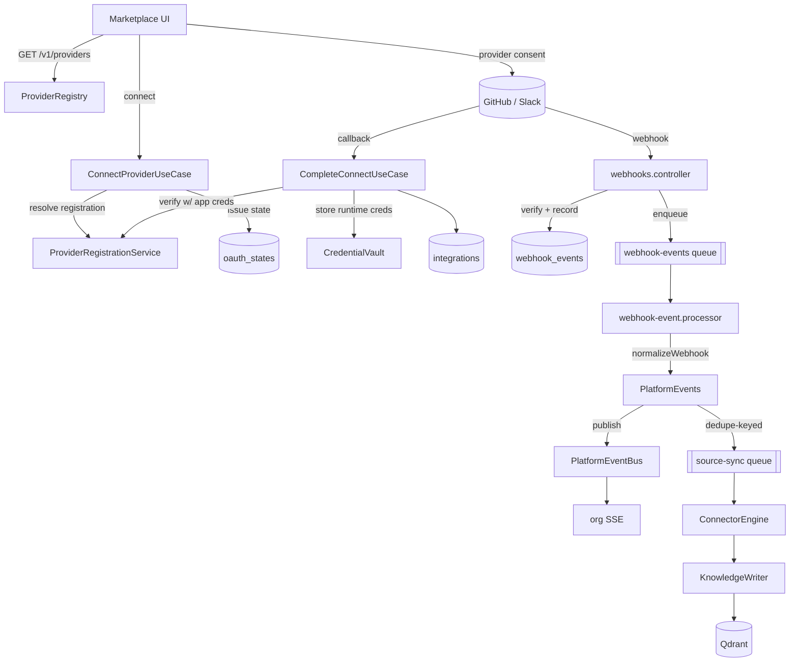

# Provider Platform

> Meshify is not "an app with GitHub and Slack integrations." It is an
> **Enterprise Integration Platform** where GitHub, Slack, and every future
> source (GitLab, SharePoint, Jira, Notion, …) are implementations of one
> generic **Provider** contract. Adding a provider means implementing the
> contract, registering it, and adding UI metadata — no core changes.

## The four layers

```
Organization
    ↓  authorizes an app registration
Provider Registration   — app credentials, OAuth config, webhook secret, mode (managed | byoa)
    ↓  OAuth connect creates
Integration             — installation/workspace id, runtime tokens, health, sync state
    ↓  a project attaches
Resource / Connector    — a repository, channel, drive the project ingests
    ↓  the engine normalizes
Knowledge               — embedded, provider-agnostic KnowledgeItems in Qdrant
```

Each arrow is a boundary. The layer above owns the layer below; nothing reaches
back up. The AI/retrieval layer sees only **Knowledge** — it has no provider
imports.

## Ownership split (the load-bearing distinction)

| Layer | Owns | Table(s) |
| --- | --- | --- |
| **Provider Registration** | application-level credentials (app id, client secret, private key, webhook secret), OAuth config, redirect URIs, mode | `provider_registrations`, `provider_registration_credentials` |
| **Integration** | runtime credentials (installation/bot/refresh tokens), external account identity, health, sync cursors | `integrations`, `integration_credentials` |

This split is why OAuth works at all: **app credentials must exist before an
Integration does** (you can't build a consent URL without the app's client id /
slug). The Provider Registration resolves them first. Every org has a *virtual
managed* registration (from deployment env, no DB row); creating a BYOA
registration switches future connects to the org's own app. An Integration's
`registration_id` is authoritative — a managed-connected integration never
silently retargets to a BYOA app added later (installations/tokens are
app-bound).

## Components (`packages/providers`)

| Component | Responsibility |
| --- | --- |
| `base/` | The contracts: `Provider` + capability interfaces (`OAuthCapable`, `WebhookCapable`, `SyncCapable`, `HealthCapable`, `ResourceBrowsingCapable`, `CitationCapable`, `ByoaCapable`, `ToolCapable`), `ProviderManifest`, `IntegrationContext`/`RegistrationContext`, the canonical resource model, typed errors |
| `registry/` | `ProviderRegistry` (single resolution point — no provider conditionals elsewhere) and `ProviderRegistrationService` (managed-vs-BYOA resolution) |
| `engine/` | `ConnectorEngine` — batching, hash-skip, purge-before-reingest, the `KnowledgeSink` providers write to |
| `vault/` | `CredentialVault` over `CredentialStore`/`SecretCipher` ports; the only reader/writer of secrets |
| `events/` | provider-independent `PlatformEvent` vocabulary + `PlatformEventBus` port (Redis Pub/Sub impl) |
| `oauth/` | `OAuthStateService` — single-use, org-bound, server-side state |
| `github/`, `slack/` | the two shipped providers (logic only; HTTP transports live in `@meshify/github` / `@meshify/slack`) |
| `catalog/` | manifest-only "coming soon" entries |
| `testing/` | fakes + `providerContractTests` — the acceptance gate every provider passes |

## Capability model

A provider advertises capabilities in its **manifest**; the platform and UI
adapt to those flags. A declared capability MUST be backed by its interface
(the contract tests enforce both directions). Resolution is always
`registry.get(id)` + a `supportsX(provider)` type guard — never
`if (id === 'github')`.

## Request/event flow



## Where each concern lives

- **Adding a provider** → [Adding a Provider](../contributing/adding-a-provider.md)
- **OAuth flow detail** → [OAuth Guide](oauth-guide.md)
- **Webhook flow detail** → [Webhook Guide](webhook-guide.md)
- **BYOA / registrations** → [BYOA Guide](byoa-guide.md)
- **Sync engine internals** → [Connector Engine](connector-engine.md)
- **Secrets** → [Credential Vault](credential-vault.md)
- **Ops** → [Production Operations](../operations/provider-platform-operations.md)

## Rules (enforced by convention + contract tests)

- No provider-specific code outside `packages/providers/src/<id>/` (composition-root env wiring excepted).
- No secret ever appears in a DTO, log line, or the frontend.
- Every request read is org-scoped (`findByIdForOrg` / `loadIntegrationForOrg`); cross-org access is `404`, never `403`.
- A declared capability is a backed capability.
- New providers add rows and UI metadata, never migrations or core edits.

---
[← Handbook](../README.md)
