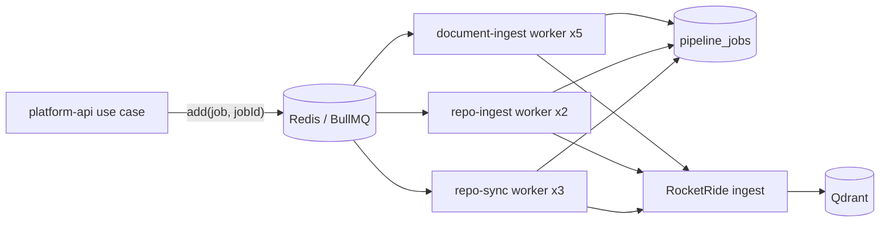
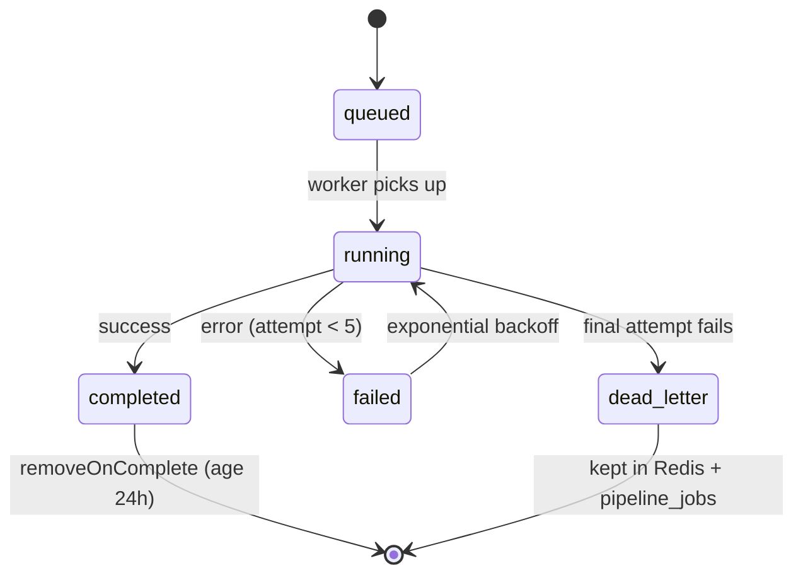

# Queues & Workers

> All slow work (ingestion) is asynchronous. `apps/platform-api` enqueues jobs
> on Redis-backed **BullMQ** queues; `apps/worker` consumes them. Job records
> are durable in both Redis (DLQ) and Postgres (`pipeline_jobs`).

## Overview

Three queues (`packages/queues/src`):

| Queue | Constant | Producer | Worker concurrency |
| --- | --- | --- | --- |
| `document-ingest` | `DOCUMENT_INGEST_QUEUE` | `UploadDocumentUseCase` | 5 |
| `repo-ingest` | `REPO_INGEST_QUEUE` | connect/upload-zip use cases | 2 |
| `repo-sync` | `REPO_SYNC_QUEUE` | `SyncRepositoryUseCase` | 3 |

Concurrency is tuned in `apps/worker/src/main.ts` (repo work is heavier, so lower).

## Architecture

### Job lifecycle & retries

Defaults live in `packages/queues/src/job-options.ts`: **5 attempts**,
exponential backoff (5s base), `removeOnComplete: { age: 24h }`,
`removeOnFail: false` (failed jobs are retained as the DLQ).

## Implementation

### Idempotency
Every enqueue pins `jobId` to the `pipeline_jobs` row id, so re-enqueuing the
same job is a no-op — see the `.add('…', payload, { jobId: pipelineJobId })`
calls in the use cases.

### Durable record
Alongside BullMQ, each job has a `pipeline_jobs` row transitioned by the worker
(`markRunning`, `markCompleted`, `markFailed(…, 'dead_letter')`) — the
system-of-record DLQ that survives Redis eviction.

### Graceful shutdown
`apps/worker/src/main.ts` handles `SIGTERM`/`SIGINT` by `await`-ing
`worker.close()` on all workers (drains in-flight jobs) before closing the
RocketRide pool and Redis.

### Processors
- `document-ingest.processor.ts` — download → ingest → mark embedded.
- `repo-ingest.processor.ts` — fetch archive → scan → batched ingest → mark synced.
- `repo-sync.processor.ts` — re-sync a connected repo.

## Best Practices
- Enqueue with a deterministic `jobId` for idempotency.
- Keep processors idempotent (a retried job must be safe to re-run).
- Transition the `pipeline_jobs` row so failures are visible in Postgres, not just Redis.

## Common Mistakes
- Doing ingestion inline in a request (blocks the response; not retryable).
- Enqueuing without a `jobId` (duplicate jobs on retry paths).
- Raising worker concurrency without accounting for RocketRide/Qdrant load.

## Troubleshooting
| Symptom | Cause | Fix |
| --- | --- | --- |
| Job never runs | Worker not running / wrong `REDIS_URL` | Start `apps/worker`; check Redis |
| Job dead-lettered | 5 attempts failed | Inspect `pipeline_jobs.last_error`; fix + re-enqueue |
| Redis growing | Failed jobs retained (`removeOnFail:false`) | Bounded DLQ is a documented follow-up |

## Examples
Queue factories + defaults: `packages/queues/src/{document-ingest.queue,repo-queues,job-options}.ts`.

## References
- `apps/worker/src/main.ts`, `apps/worker/src/processors/**`
- `packages/queues/src/**`, `packages/data-access/src/pipeline-jobs/**`

## Related
- [RAG & Ingestion](../ai/rag-and-ingestion.md) · [`queues` README](../../packages/queues/README.md)

## Next
- [Operations](../operations/deployment.md).

---
[← Handbook](../README.md)
