# Real-Time Job Progress

> Background jobs (document/repo/Slack ingestion & sync) push live progress to
> the browser — no polling. Workers publish progress over Redis Pub/Sub;
> platform-api streams it per-project over Server-Sent Events; the web app's
> global **Job Progress Center** renders it.

## Overview

The worker and platform-api are separate processes, so progress makes two hops:

1. **worker → platform-api** — Redis Pub/Sub (both already hold a Redis
   connection; no new infra).
2. **platform-api → browser** — Server-Sent Events (plain HTTP; flows through
   the existing streaming BFF proxy unchanged; `EventSource` auto-reconnects).

SSE was chosen over WebSockets/Socket.IO (job progress is one-way; SSE needs no
upgrade handling, sticky sessions, or new dependencies) and over BullMQ
`QueueEvents` alone (a single `projectId`-routed channel is simpler and
extensible to non-queue producers). See the feature audit for the full
comparison.

## Architecture

```mermaid
flowchart LR
  proc[worker processor] -- JobProgress --> pub[JobEventPublisher]
  pub -- PUBLISH meshify:jobs --> redis[(Redis Pub/Sub)]
  redis --> sub[JobEventSubscriber]
  sub --> hub[JobEventHub]
  hub -- per-project fan-out --> sse[GET /v1/projects/:id/jobs/stream]
  sse -- text/event-stream --> bff[BFF proxy] --> es[EventSource]
  es --> center[Job Progress Center]
```

**Horizontal scaling:** every platform-api replica subscribes to the channel and
serves only its locally-connected SSE clients — no sticky sessions.

## Implementation

### Transport (`packages/queues`)
`JobEvent` + `JobEventPublisher`/`JobEventSubscriber` wrap Redis Pub/Sub behind
structural interfaces (the package stays ioredis-free, mirroring how it wraps
BullMQ). Channel: `meshify:jobs`.

### Producing progress (`apps/worker`)
`JobProgress` (`processors/job-progress.ts`) persists the current stage/percent
to `pipeline_jobs` **and** publishes a `JobEvent`. Every processor reports
fine-grained stages; loop-based stages carry real percentages, while
RocketRide-internal embedding is coarse (opaque). Lifecycle events
(`running`/`completed`/`failed`/`retry`) are emitted by the shared
`runPipelineJob` wrapper and inline in the document/repo processors.

### Consuming + streaming (`apps/platform-api/src/modules/jobs`)
`JobEventHub` (infrastructure) subscribes once and fans events out to per-project
listeners behind the `JobEventStream` port. The SSE route seeds with the current
active jobs (`ListProjectJobsUseCase` → snapshot) then pushes live events, with a
15s heartbeat and cleanup on disconnect. Guarded by the existing
`projectIsolationGuard`.

### Consuming in the UI (`apps/web/src/components/jobs`)
`JobsProvider` opens one `EventSource` per project, reduces events into
active/history state, and drives the generic `JobProgressCenter → JobCard`
(one component for every job type via `jobPresentation(jobType)`). Pages call
`useRefreshOnJobComplete` to refresh their lists on completion — replacing the
former 3s document poll.

## Best Practices
- Emit progress through `JobProgress`; never publish raw events from a processor.
- Keep the SSE route free of business logic — snapshot via a use case, live via the port.
- New job types need no new UI: add a `jobPresentation` entry (icon + label).

## Common Mistakes
- Buffering the SSE response (compression/proxy) — set `X-Accel-Buffering: no` and no compression on the stream path.
- Reusing a subscribe-mode Redis connection for commands — the subscriber needs a dedicated connection.
- Polling job status from the frontend — subscribe to the stream instead.

## Troubleshooting
| Symptom | Cause | Fix |
| --- | --- | --- |
| No live updates | SSE blocked/buffered by a proxy | Disable buffering on `/jobs/stream`; confirm `EventSource` connected |
| Progress stuck at a stage | RocketRide-internal step (opaque) | Expected — embedding/vector-write are coarse |
| Events for the wrong project | Missing projectId routing | Events are filtered by `projectId` in the hub |

## References
- `packages/queues/src/job-events.ts`
- `apps/worker/src/processors/job-progress.ts`, `run-pipeline-job.ts`
- `apps/platform-api/src/modules/jobs/**`
- `apps/web/src/components/jobs/**`
- Migration `packages/data-access/migrations/0010_job_progress.sql`

## Related
- [Queues & Workers](queues-and-workers.md) · [Frontend](../architecture/frontend.md) · [Data Model](../architecture/data-model.md)

## Next
- [Frontend Architecture](../architecture/frontend.md).

---
[← Handbook](../README.md)
