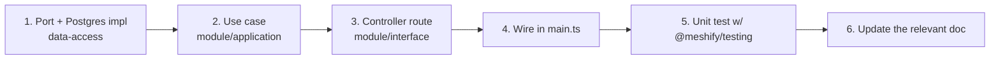

# Contributing

> Consistency is the feature. Follow the layering, use the shared packages, add
> tests and docs in the same PR as the code.

## Overview

Meshify keeps long-term consistency by enforcing a few rules and by co-locating
documentation with the code it describes. This page is the checklist.

## How to add a backend feature

1. **Data:** add/extend a repository **port** and its Postgres implementation in `packages/data-access`.
2. **Logic:** write a `*.usecase.ts` in the module's `application/`.
3. **HTTP:** add a route to the module's `*.controller.ts` (zod validation + DTO mapping).
4. **Wire:** construct and inject it in `apps/platform-api/src/main.ts`.
5. **Test:** unit-test the use case with in-memory ports from [`@meshify/testing`](../../packages/testing/README.md).
6. **Document:** update the affected doc/README in the same PR.

## How to add a frontend feature
- Add API methods to `apps/web/src/api.ts` (`MeshifyApi`), not inline `fetch`.
- Add routes as `React.lazy` in `App.tsx`; keep the landing eager.
- Reuse `mc.*` tokens and shared primitives.

## The rules (enforced by convention)
- RocketRide SDK only in `rocketride-gateway`.
- Raw SQL only in `data-access`.
- No repositories or business logic in controllers.
- One root `.env`; new vars go through `@meshify/config`.

## Living documentation
- **Reference source, don't restate it.** Link to files, package names, and folders so docs track code.
- Every doc uses [`_TEMPLATE.md`](../_TEMPLATE.md) and links back to the [Handbook](../README.md).
- If your change makes a doc wrong, fix the doc in the same PR — a stale doc is a bug.

## Best Practices
- Keep PRs behavior-scoped and reversible; land infra before big migrations.
- Prefer aggregate SQL over row-loading; prefer derived state over effects.
- Run `pnpm typecheck && pnpm test` before pushing.

## Common Mistakes
- Skipping the port and querying Postgres in a use case.
- Adding a page eagerly to `App.tsx` (bloats the landing chunk).
- Leaving docs behind — they are part of the change.

## References
- Root [`README.md`](../../README.md), [`TESTING.md`](../../TESTING.md), the doc [`_TEMPLATE.md`](../_TEMPLATE.md)

## Related
- [Backend](../architecture/backend.md) · [Frontend](../architecture/frontend.md) · [Testing](../testing/index.md)

## Next
- [Glossary](../reference/glossary.md).

---
[← Handbook](../README.md)
