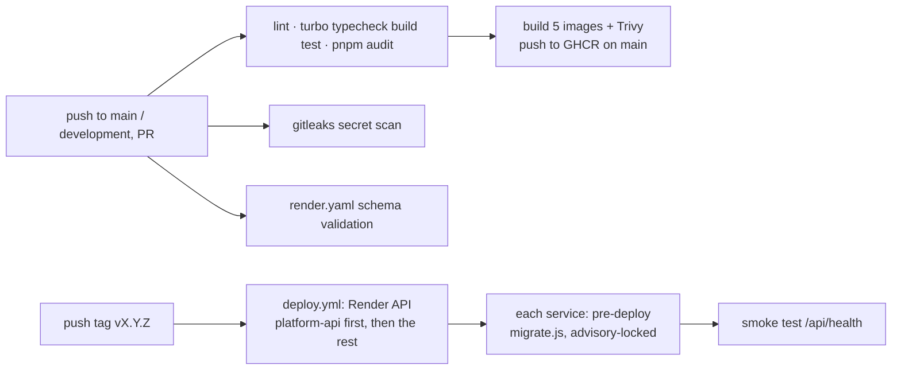
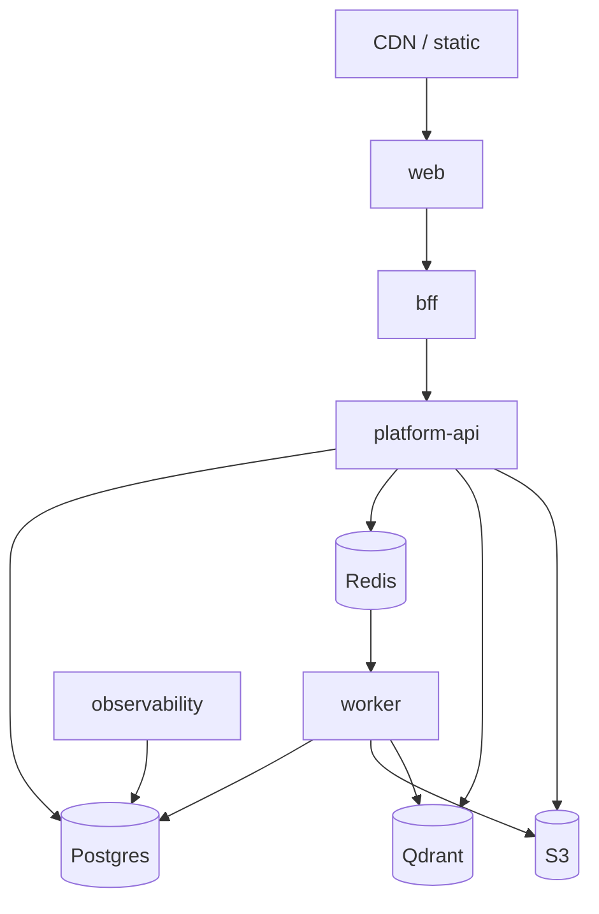

# Deployment, CI/CD & Observability

> Five processes ship independently from one monorepo. Turbo caches builds and
> tests; every service exposes liveness/readiness; logs are structured and
> credential-safe.

## Overview

- **Build/test:** Turbo (`turbo.json`) with dependency-aware, cached tasks.
- **Deploy targets:** `apps/web` (nginx-served SPA, the only public origin), `apps/bff`, `apps/platform-api`, `apps/worker`, `apps/observability` - one Docker image each. **Render** is the production path (root [`render.yaml`](../../render.yaml) Blueprint + tag-driven [`deploy.yml`](../../.github/workflows/deploy.yml)); Railway (`apps/*/railway.toml`) and Kubernetes (`infrastructure/kubernetes/`) are the alternatives. See the [Deployment Runbook](DEPLOYMENT_RUNBOOK.md).
- **Dependencies:** Postgres, Redis, Qdrant, S3-compatible storage, RocketRide.

## Architecture

### CI/CD pipeline

Turbo restores unchanged packages from cache; `--filter=...[origin/main]` runs
only affected packages and their dependents. On Render, migrations run as every
Node service's **pre-deploy command** inside the built image
(`node node_modules/@meshify/data-access/dist/migrate.js`); the migrator holds a
Postgres advisory lock so concurrent runners serialize. On Kubernetes the
equivalent is the pre-rollout migrate Job.

### Runtime topology

## Implementation

### Health & lifecycle
- **Liveness:** `GET /health/live` (process up, no deps).
- **Readiness:** `GET /health/ready` (checks Postgres/Redis/Qdrant) — gate rollouts on this.
- **Graceful shutdown:** each `main.ts` handles `SIGTERM`/`SIGINT`, closing queues, workers (drain in-flight), the RocketRide pool, Redis, and the pg pool.

### Observability
- **Structured logs:** `pino` via `@meshify/shared`, with `pino-http` request logging + correlation ids. Credentials are redacted (`packages/shared/src/logger.ts`).
- **Pipeline traces:** `apps/observability` consumes RocketRide pipeline events into `pipeline_runs` / `pipeline_run_traces`.
- **Metrics:** Prometheus `/metrics` on platform-api (HTTP request durations + process defaults) and on the worker's metrics port (BullMQ queue depth by state + process defaults), gated by `METRICS_TOKEN` (required in production). See [OBSERVABILITY.md](OBSERVABILITY.md).

### Configuration
Validated at boot by `@meshify/config`; a bad/missing env var fails fast. See
[Environment Variables](../reference/environment-variables.md).

## Best Practices
- Gate deploys on `/health/ready`, not `/health/live`.
- Run migrations before rolling the API/worker.
- Scale the worker independently of the API (ingestion is the heavy path).

## Common Mistakes
- Rolling the API before applying migrations.
- Sharing one Redis connection between the health checker and BullMQ (BullMQ needs `maxRetriesPerRequest: null`).
- Deploying without the readiness gate.

## Troubleshooting
See [Troubleshooting](troubleshooting.md) for symptom → fix. Common: readiness
`503` means a downstream dependency is unreachable — the body names which.

## References
- `turbo.json`, `infrastructure/`, each `apps/*/src/main.ts`
- `apps/platform-api/src/modules/health/**`, `apps/observability/src/**`

## Related
- [Queues & Workers](../backend/queues-and-workers.md) · [Troubleshooting](troubleshooting.md)

## Next
- [Troubleshooting](troubleshooting.md).

---
[← Handbook](../README.md)
