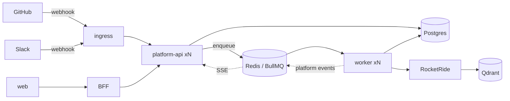

# Provider Platform — Production Operations

## Deployment prerequisites

The provider platform adds no new services. It needs, on top of the base stack
(Postgres, Redis, Qdrant, S3, RocketRide):

1. **A public ingress to `platform-api`** for `/v1/integrations/webhooks/*`
   (providers must reach it). Only platform-api is internet-facing; the BFF and
   web stay private. Ensure the ingress does **not** buffer or rewrite the
   webhook request body (signatures cover raw bytes) and passes SSE unbuffered
   (`X-Accel-Buffering: no` is set by the app).
2. **Managed provider apps**, created once by the operator (never by customers):
   - GitHub App → `GITHUB_APP_ID`, `GITHUB_APP_PRIVATE_KEY`, `GITHUB_APP_SLUG`,
     `GITHUB_APP_WEBHOOK_SECRET`. Its webhook URL →
     `https://<api-host>/api/v1/integrations/webhooks/github`.
   - Slack app → `SLACK_CLIENT_ID`, `SLACK_CLIENT_SECRET`, `SLACK_REDIRECT_URI`
     (→ the web `/oauth/slack/callback` or generic `/oauth/:provider/callback`),
     `SLACK_SIGNING_SECRET`. Events request URL →
     `https://<api-host>/api/v1/integrations/webhooks/slack`.
   - Any provider left unconfigured simply shows as "not configured" in the
     marketplace — the platform boots fine without it.
3. **`INTEGRATION_ENCRYPTION_KEY`** (≥32 chars) — encrypts all integration and
   registration secrets. Falls back to `ORG_KEY_ENCRYPTION_KEY`; set separately
   to decouple rotation domains.

See [Environment Variables](../reference/environment-variables.md).

## Runtime topology

- `platform-api` and `worker` are **stateless and horizontally scalable**. Scale
  workers for sync throughput (`--scale worker=N`).
- The maintenance Job Scheduler is idempotent across replicas — safe to run many
  workers.

## Scheduled maintenance (worker)

| Sweep | Interval | Does |
| --- | --- | --- |
| `refresh` | 15 min | rotate credentials expiring <30 min; enqueue reconcile syncs for stale (event-trigger, idle >24 h) and interval-due connectors |
| `health` | 1 h | provider health check per active integration; emit `health.changed` on transitions |
| `retention` | 24 h | prune terminal `webhook_events` >30 d, expired `oauth_states` >24 h |

## Monitoring — what to watch

- **Queue depth** (`source-sync`, `webhook-events`, `document-ingest`) — sustained
  growth means workers are under-provisioned or a provider is failing.
- **`pipeline_jobs` in `dead_letter`** — the durable DLQ; inspect `last_error`.
- **Integration health distribution** — a spike in `needs_reauthorization`
  usually means expired tokens or a rotated provider secret.
- **Webhook `webhook_events.status = 'failed'`** — dispatch errors; retried by
  BullMQ, inspect `error`.
- **429s from providers** — sync fan-out hitting GitHub/Slack rate limits.

## Common operations

- **Rotate a managed app secret** — update the env var and redeploy; the managed
  registration reads env at resolve time (no DB migration).
- **Onboard an enterprise BYOA org** — the org admin submits credentials via the
  marketplace (`PUT /v1/providers/:provider/registration`) and points their
  app's webhook at the returned per-registration URL.
- **Force a re-sync** — a user clicks "Sync now" (manual mode, same code path),
  or wait for the reconcile sweep.
- **Disable a provider** — remove its managed env vars; existing BYOA orgs keep
  working, managed connects show "not configured."

See [Disaster Recovery](disaster-recovery.md) for failure playbooks.

---
[← Handbook](../README.md)
